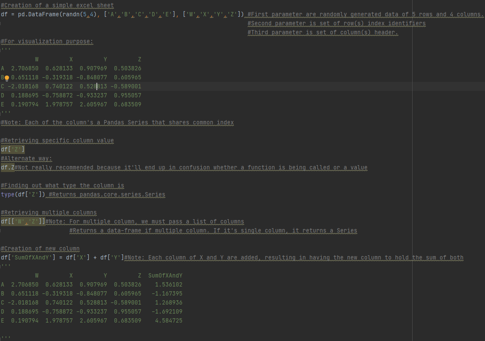
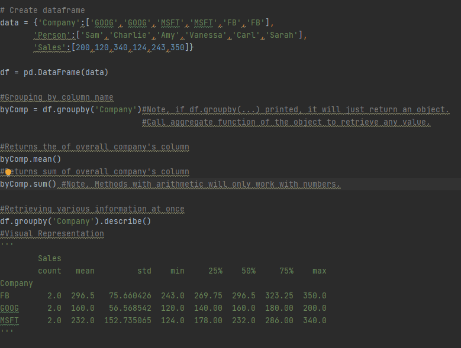
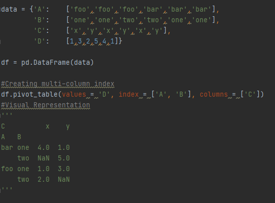
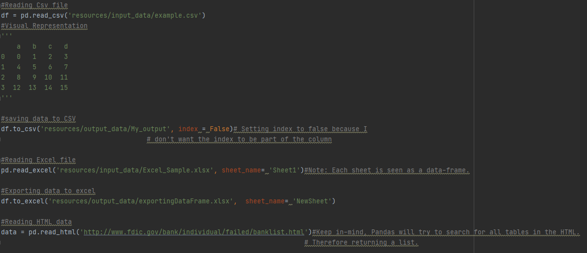

# pythonWithPandas

##Series
Brief introduction of setting data of a Series using an Array, List, and a Dictionary.

##Dataframes
####Selection and Indexing:
- Creation of simple Table.
- Retrieval of specific columns & values of a table.
- Addition and deletion of specific rows & columns.

####Group-by
Fetching grouped table data using dataframe implemented methods.

####Operations
- Retrieval of unique both row and column values.
- Application of both method and lambda within a dataframe.
- Sorting dataframe using specific conditions.

####Data Input and Output
- CSV
- Excel
- HTML
- SQL
